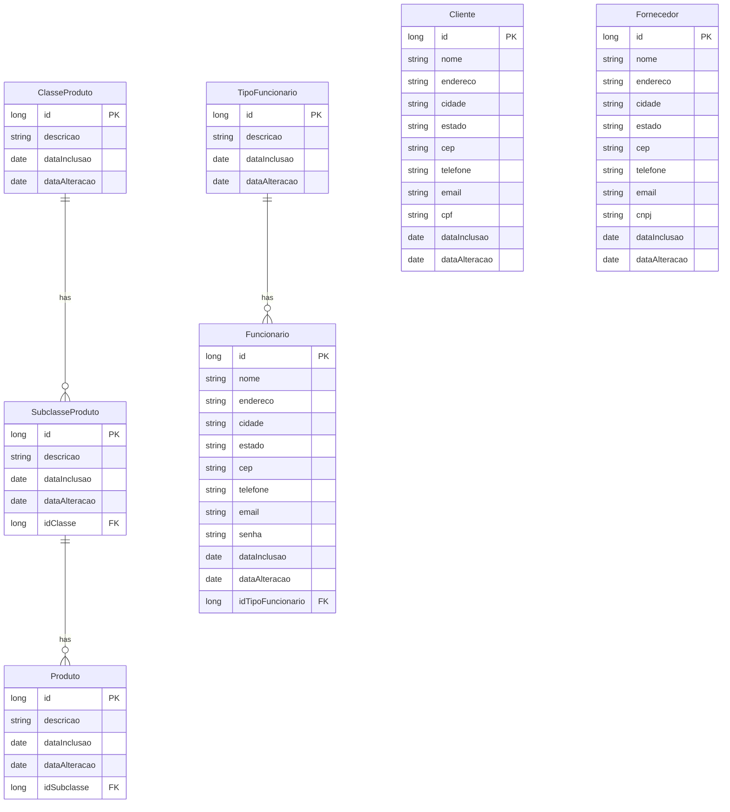

# Projeto API do Estoque

Projeto para aplicar os conhecimentos da disciplina de POO2.

| Academico:    | [José A. Q. C. Gomes <code>@JoseComparotto</code>](https://github.com/JoseComparotto) | RA: 398439413098     |
| ------------- | ------------------------------------------------------------------------------------- | :------------------: |
| Curso:        | Ciência da Computação                                                                 | Noturno              |
| Professor:    | [Luiz Augusto Rodrigues <code>@profluizao</code>](https://github.com/profluizao)      |                      |
| Disciplina:   | Programação Orientada a Objetos II                                                    | 2024.2 - 6º Semestre |
| Universidade: | [Anhanguera-Uniderp - Matriz](https://www.uniderp.com.br/)                            | Campo Grande, MS     |

## Pilha de Tecnologias

- **OpenAPI 3.0:** Documentação da API compativel com o padrão RESTfull.

- **Java 21.0:** Linguagem de Programação (Back-end)

- **Maven 4.0:** Gerenciador de Pacotes Java

- **Spring-Boot 3.3:** Framework do ecossistema Spring para Back-end

- **Spring Data JPA e Hibernate**: Framework ORM para abstrair a camada de persistência de dados.

- **H2 Database**: Banco de Dados In-Memory.

## Definições UML

### Diagrama de Classes

### Diagrama Entidade-Relacionamento

## Especificações da API

- [Swagger UI](https://josecomparotto.github.io/poo2/projetos/estoque/pages/swagger-ui.html)
- [Open API (JSON)](./docs/openapi.json)

