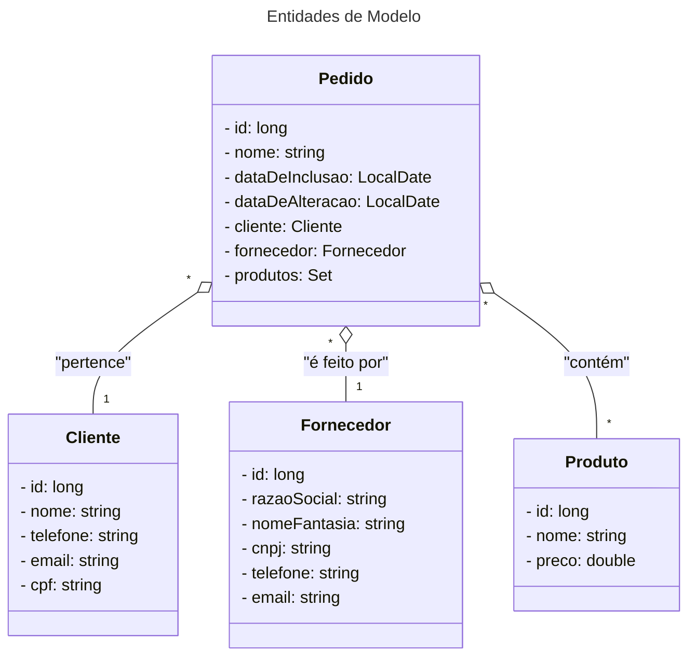
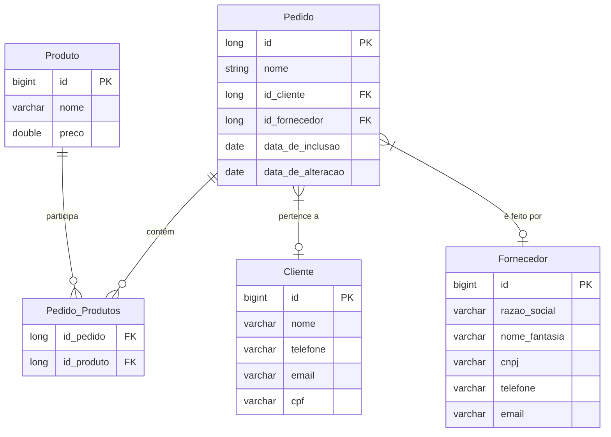

# Atividade A2 - Projeto VetShop API

Projeto referente à Atividade A2 da disciplina de POO2

| Academico:    | [José A. Q. C. Gomes <code>@JoseComparotto</code>](https://github.com/JoseComparotto) | RA: 398439413098     |
| ------------- | ------------------------------------------------------------------------------------- | :------------------: |
| Curso:        | Ciência da Computação                                                                 | Noturno              |
| Professor:    | [Luiz Augusto Rodrigues <code>@profluizao</code>](https://github.com/profluizao)      |                      |
| Disciplina:   | Programação Orientada a Objetos II                                                    | 2024.2 - 6º Semestre |
| Universidade: | [Anhanguera-Uniderp - Matriz](https://www.uniderp.com.br/)                            | Campo Grande, MS     |

## Pilha de Tecnologias

- **OpenAPI 3.0:** Documentação da API compativel com o padrão RESTfull.

- **Java 21.0:** Linguagem de Programação (Back-end)

- **Maven 4.0:** Gerenciador de Pacotes Java

- **Spring-Boot 3.3:** Framework do ecossistema Spring para Back-end

- **Spring Data JPA e Hibernate**: Framework ORM para abstrair a camada de persistência de dados.

- **H2 Database**: Banco de Dados In-Memory.

## Estrutura de Diretórios

```plain
📦vetshop
 ┣ 📂docs   // Documentação do projeto
 ┣ 📂pages  // Página para o GitHub Pages com o Swagger UI
 ┗ 📂src/main/java/br/com/apirest/vetshop
   ┣ 📂config       // Configurações para o Spring-Boot (Ex: CORS)
   ┣ 📂controller   // Camada de Apresentação, neste caso com os End-Points da API
   ┣ 📂model        // Camada de Modelo
   ┣ 📂repository   // Camada de Repositório 
   ┣ 📂service      // Camada de Serviço
   ┗ 📜VetshopApplication.java  // Classe Principal Java
 ```

## Especificações da API

- [Open API (JSON)](./docs/openapi.json)
- [Swagger UI](https://josecomparotto.github.io/poo2/projetos/vetshop/pages/swagger-ui.html)

## Definições UML

### Diagrama de Classes



### Diagrama Entidade-Relacionamento


