# Atividade A2 - Projeto VetShop API

Projeto referente à Atividade A2 da disciplina de POO2

| Academico:    | [José A. Q. C. Gomes <code>@JoseComparotto</code>](https://github.com/JoseComparotto) | RA: 398439413098     |
| ------------- | ------------------------------------------------------------------------------------- | :------------------: |
| Curso:        | Ciência da Computação                                                                 | Noturno              |
| Professor:    | [Luiz Augusto Rodrigues <code>@profluizao</code>](https://github.com/profluizao)      |                      |
| Disciplina:   | Programação Orientada a Objetos II                                                    | 2024.2 - 6º Semestre |
| Universidade: | [Anhanguera-Uniderp - Matriz](https://www.uniderp.com.br/)                            | Campo Grande, MS     |

## Pilha de Tecnologias

- **OpenAPI 3.0:** Documentação da API compativel com o padrão RESTfull.

- **Java 21.0:** Linguagem de Programação (Back-end)

- **Maven 4.0:** Gerenciador de Pacotes Java

- **Spring-Boot 3.3:** Framework do ecossistema Spring para Back-end

- **Spring Data JPA e Hibernate**: Framework ORM para abstrair a camada de persistência de dados.

- **H2 Database**: Banco de Dados In-Memory.

## Estrutura de Diretórios

```plain
📦vetshop
 ┣ 📂docs   // Documentação do projeto
 ┣ 📂pages  // Página para o GitHub Pages com o Swagger UI
 ┗ 📂src/main/java/br/com/apirest/vetshop
   ┣ 📂config       // Configurações para o Spring-Boot (Ex: CORS)
   ┣ 📂controller   // Camada de Apresentação, neste caso com os End-Points da API
   ┣ 📂model        // Camada de Modelo
   ┣ 📂repository   // Camada de Repositório 
   ┣ 📂service      // Camada de Serviço
   ┗ 📜VetshopApplication.java  // Classe Principal Java
 ```

## Especificações da API

- [Open API (JSON)](./docs/openapi.json)
- [Swagger UI](https://josecomparotto.github.io/poo2/projetos/vetshop/pages/swagger-ui.html)

## Definições UML

### Diagrama de Classes

```mermaid
---
title: Entidades de Modelo
---
classDiagram

    class Cliente {
        - id: long
        - nome: string
        - telefone: string
        - email: string
        - cpf: string
    }

    class Fornecedor {
        - id: long
        - razaoSocial: string
        - nomeFantasia: string
        - cnpj: string
        - telefone: string
        - email: string
    }

    class Produto {
        - id: long
        - nome: string
        - preco: double
    }

    class Pedido {
        - id: long
        - nome: string
        - dataDeInclusao: LocalDate
        - dataDeAlteracao: LocalDate
        - cliente: Cliente
        - fornecedor: Fornecedor
        - produtos: Set<Produto>
    }

    Pedido "*" o-- "1" Cliente : "pertence"
    Pedido "*" o-- "1" Fornecedor : "é feito por"
    Pedido "*" o-- "*" Produto : "contém"

```



### Diagrama Entidade-Relacionamento

```mermaid
erDiagram

    Cliente {
        bigint id PK
        varchar nome
        varchar telefone
        varchar email
        varchar cpf
    }

    Fornecedor {
        bigint id PK
        varchar razao_social
        varchar nome_fantasia
        varchar cnpj
        varchar telefone
        varchar email
    }

    Produto {
        bigint id PK
        varchar nome
        double preco
    }

    Pedido {
        long id PK
        string nome
        long id_cliente FK
        long id_fornecedor FK
        date data_de_inclusao
        date data_de_alteracao
    }

    Pedido_Produtos {
        long id_pedido FK
        long id_produto FK
    }

    Produto ||--o{ Pedido_Produtos : "participa"
    Pedido ||--o{ Pedido_Produtos : "contém"
    Pedido }|--o| Cliente : "pertence a"
    Pedido }|--o| Fornecedor : "é feito por"

```


